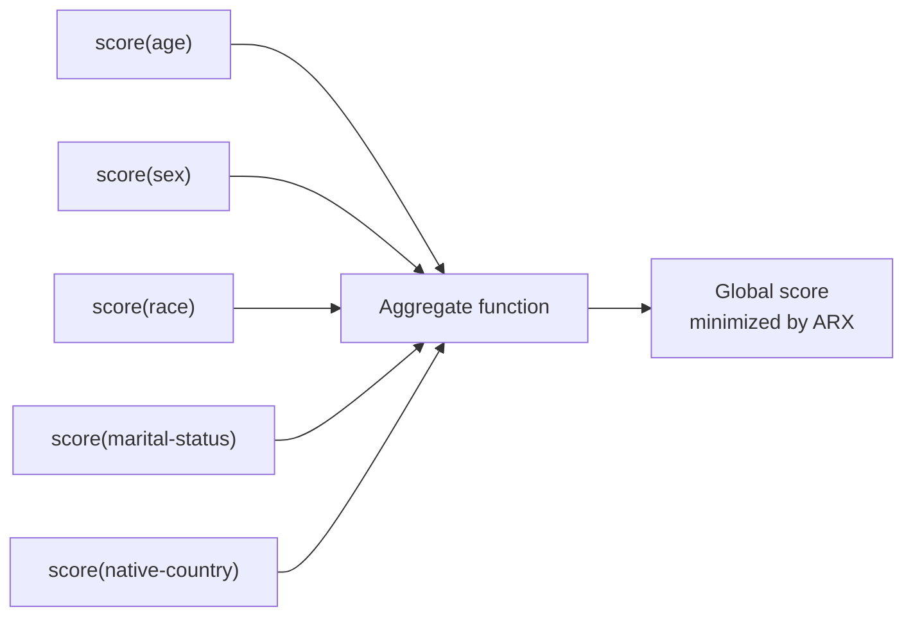

# Aggregate Functions

Aggregate functions combine the utility scores computed **per attribute** into a **single global score** used by ARX to compare and choose between different transformations.

---

## Role

Some [quality models](mesures_utilite.md) (`loss`, `height`, `precision`, `nm_entropy`) produce a score **per quasi-identifier**. The aggregate function determines how these individual scores are merged into a scalar value that the optimizer can minimize.



---

## Available aggregate functions

### `arithmetic_mean` — Arithmetic Mean *(default)*

Computes the simple average of per-attribute scores.

$$\text{global score} = \frac{1}{n} \sum_{i=1}^{n} s_i$$

- Treats all attributes equally.
- Sensitive to outlier scores.

---

### `geometric_mean` — Geometric Mean

Computes the geometric mean of per-attribute scores.

$$\text{global score} = \left(\prod_{i=1}^{n} s_i\right)^{1/n}$$

- Less sensitive to extreme values than the arithmetic mean.
- Tends to penalize heavily degraded attributes more strongly.

---

### `sum` — Sum

Computes the raw sum of per-attribute scores.

$$\text{global score} = \sum_{i=1}^{n} s_i$$

- Equivalent to the arithmetic mean for ranking purposes (same preference order).
- Amplifies the impact of the number of attributes.

---

### `maximum` — Maximum

Retains only the highest score among all attributes.

$$\text{global score} = \max(s_1, s_2, \ldots, s_n)$$

- **Minimax** strategy: minimizes the worst-case loss on any single attribute.
- Favors transformations that do not excessively degrade any one attribute.

---

### `rank` — Rank

Represents scores as a sorted vector and compares transformations lexicographically.

$$\text{global score} = [s_{\sigma(1)}, s_{\sigma(2)}, \ldots, s_{\sigma(n)}]$$

where $\sigma$ sorts in descending order.

- Compares the most degraded attributes first before breaking ties on others.
- Multi-criteria approach without scalar aggregation.

---

## Compatibility

Aggregate functions are only compatible with quality models that produce **per-attribute** scores:

| Quality model | Aggregate supported |
|---|:---:|
| `loss` | ✓ |
| `height` | ✓ |
| `precision` | ✓ |
| `nm_entropy` | ✓ |
| `entropy` | ✗ |
| `discernibility` | ✗ |
| `aecs` | ✗ |
| `ambiguity` | ✗ |
| `classification` | ✗ |

---

## Attribute weights

Individual attributes can be weighted via the `attribute_weights` parameter. A higher weight means ARX will accept more generalization on that attribute; a lower weight pushes towards preserving original values.

```json
{
  "attribute_weights": {
    "age": 0.1,
    "race": 2.0
  }
}
```

---

## Configuration

```json
{
  "utility_measure": "loss",
  "utility_aggregate": "arithmetic_mean"
}
```

If `utility_aggregate` is absent or `null`, ARX uses its internal default.
