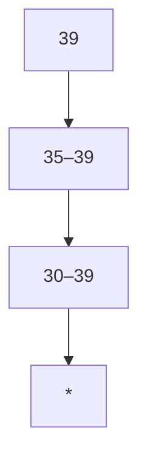
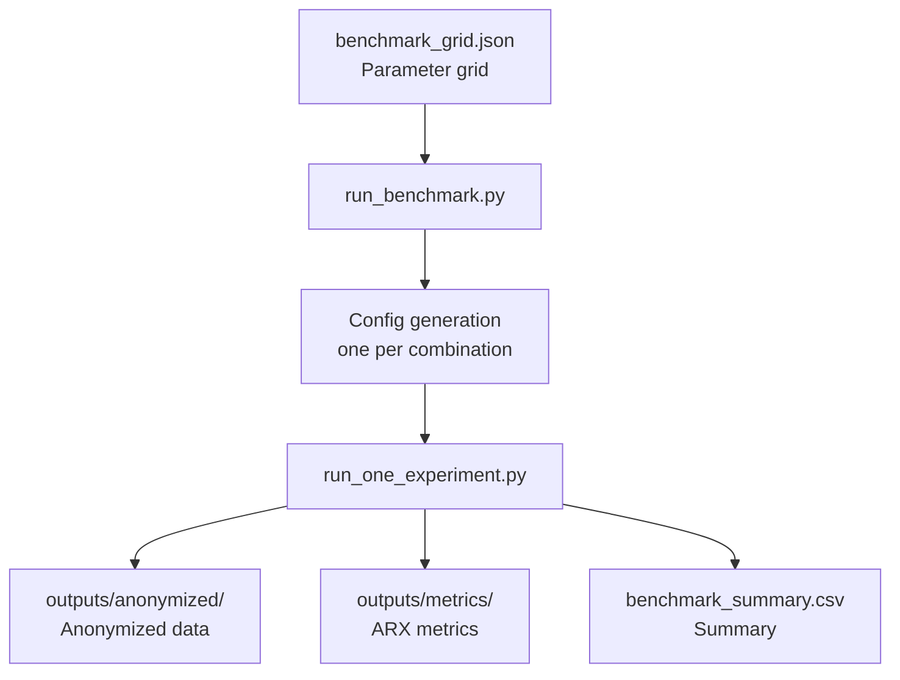

# Anonymization

Anonymization transforms personal data to protect individual privacy. This project relies on the **RECITALS** framework with the **ARX** backend to anonymize the Adult dataset.

---

## Role of this step

Anonymization is the starting point of the pipeline. It produces a transformed dataset on which all utility evaluations (ARX metrics and classification) are then computed.

---

## Dataset: Adult (UCI)

The Adult dataset contains **30,000+ records** describing individuals from the U.S. Census.

### Quasi-identifiers (QI)

Quasi-identifiers are attributes that, when combined, may allow re-identification of an individual.

| Attribute | Type | Example |
|---|---|---|
| `age` | Numeric | 39 |
| `sex` | Categorical | Male, Female |
| `race` | Categorical | White, Black, Asian-Pac-Islander… |
| `marital-status` | Categorical | Married-civ-spouse, Never-married… |
| `native-country` | Categorical | United-States, Mexico… |

### Sensitive attribute

| Attribute | Type | Values |
|---|---|---|
| `income` | Binary | `<=50K`, `>50K` |

---

## Generalization hierarchies

For each quasi-identifier, a hierarchy defines the possible levels of generalization — from most specific to most general.

- **Numeric attributes** (`age`): grouped into intervals (`35–39`, `30–39`, …)
- **Categorical attributes** (`sex`, `race`, …): grouped into broader categories up to `*` (full suppression)

Hierarchies are defined as CSV files in the `hierarchies/` folder (one file per attribute).

---

## Privacy models

### k-anonymity

Each record is made indistinguishable from at least **k − 1** other records on the quasi-identifiers. The re-identification risk is bounded by **1/k**.

$$\forall \text{ equivalence group } G,\quad |G| \geq k$$

### l-diversity

Extension of k-anonymity: each equivalence group must contain at least **l** distinct values for the sensitive attribute, limiting inference on that attribute.

$$\forall \text{ equivalence group } G,\quad |\{s \in G\}| \geq l$$

### Suppression limit

A `suppression_limit` parameter (in %) allows ARX to remove a fraction of records when it is impossible to anonymize them while satisfying privacy constraints. Default: **10%**.

---

## Benchmark pipeline

Experiments are automatically generated from a parameter grid.

### Grid parameters

| Parameter | Explored values |
|---|---|
| QI subset sizes | 2, 3, 4, 5 |
| k (k-anonymity) | 2, 5, 10, 20 |
| l (l-diversity) | 2 |
| Suppression limit | 10% |

Each combination generates an independent experiment with its own identifier, JSON configuration, and output files.
