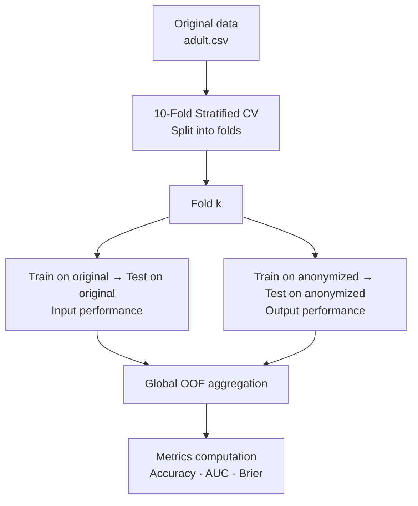

# Classification

Supervised classification is used as a second axis for utility evaluation. The idea is to measure how well a model trained on anonymized data retains its predictive performance compared to the same model trained on the original data.

---

## Role

[ARX utility metrics](../metriques/index.md) characterize the structure of the anonymized dataset. Classification brings a complementary perspective: it evaluates the **applicative utility** of the data — its capacity to train a performant predictive model.

---

## Task

**Binary prediction** of the `income` attribute (`<=50K` or `>50K`) from the quasi-identifiers (`age`, `sex`, `race`, `marital-status`, `native-country`).

---

## Evaluation pipeline

### Stratified 10-Fold Cross-Validation

The fold split is performed on the **original** data (stratified on `income`) and applied identically to the anonymized data to ensure comparability.

- **10 folds**, `shuffle=True`, `random_state=42` *(all configurable via `classification_config.json`)*
- Out-of-fold (OOF) predictions are **globally concatenated** (not averaged per fold), reproducing ARX's behavior.

### Handling suppressed records

- **Training**: rows where all QI are suppressed (`*`) are **excluded** from training on anonymized data.
- **Testing**: all rows are kept, including suppressed ones.

---

## Preprocessing of generalized values

Anonymized data contains generalized values that must be handled before being passed to classifiers:

- **Numeric ranges** (`35–39`) → **midpoint** (`37.0`)
- **Suppressed values** (`*`) → `NaN`, then imputed (mean for numeric, mode for categorical)

---

## Classifiers

Four models are available. The hyperparameters shown below are the default values used in this project, but **all of them are fully configurable** via `classification_config.json` — you can set any value supported by scikit-learn.

### ZeroR — Baseline classifier

Systematically predicts the majority class. Used as a **baseline** to compute relative accuracy.

- Implemented with `DummyClassifier(strategy="prior")`

---

### Logistic Regression

Full pipeline with preprocessing adapted to each column type:

- **Numeric columns**: `StandardScaler`
- **Categorical columns**: `OrdinalEncoder` → `OneHotEncoder`
- **Imputation**: mean (numeric), mode (categorical)

| Hyperparameter | Default value | Configurable |
|---|---|:---:|
| Penalty | ElasticNet (`l1_ratio=0.5`) | ✓ |
| C | 100,000 | ✓ |
| Solver | saga | ✓ |
| max_iter | 2,000 | ✓ |

---

### Naive Bayes — Multinomial

Attributes are discretized into uniform bins before being passed to the multinomial classifier.

- **Numeric columns**: `KBinsDiscretizer(n_bins=10, strategy="uniform", encode="onehot-dense")`
- **Categorical columns**: `OrdinalEncoder` → `OneHotEncoder`

| Hyperparameter | Default value | Configurable |
|---|---|:---:|
| alpha (Laplace smoothing) | 1.0 | ✓ |
| Number of bins | 10 | ✓ |
| Binning strategy | uniform | ✓ |

---

### Random Forest

- **Numeric and categorical columns**: `OrdinalEncoder` only (no scaling, no one-hot encoding)

| Hyperparameter | Default value | Configurable |
|---|---|:---:|
| n_estimators | 500 | ✓ |
| max_features | sqrt | ✓ |
| criterion | gini | ✓ |
| min_samples_leaf | 5 | ✓ |
| max_leaf_nodes | 100 | ✓ |
| bootstrap | True | ✓ |
| max_samples | 1.0 | ✓ |

---

## Evaluation metrics

All metrics are computed twice: on **input** predictions (model trained on original data) and **output** predictions (model trained on anonymized data).

### Relative accuracy

Normalizes the output performance against the ZeroR baseline and the input performance, allowing comparison across experiments with different difficulty levels.

$$\text{relative accuracy} = \frac{\text{acc}_\text{output} - \text{acc}_\text{baseline}}{\text{acc}_\text{input} - \text{acc}_\text{baseline}}$$

- **1.0**: anonymization does not degrade performance.
- **0.0**: the output model is equivalent to the baseline.
- **< 0**: anonymization degrades performance below baseline.

---

### AUC (Area Under the ROC Curve)

Computed per class (one-vs-rest) on the predicted probabilities. A ROC curve is also exported (100 sampled points) for each class and condition (baseline / input / output).

---

### Brier Score

Measures the mean squared error on predicted probabilities.

$$\text{Brier} = \frac{1}{n} \sum_{i=1}^{n} (p_i - y_i)^2$$

A **Brier skill score** is also computed, normalized against the input score:

$$\text{BSS} = 1 - \frac{\text{Brier}_\text{output}}{\text{Brier}_\text{input}}$$

---

## Metrics summary

| Metric | Description | Best value |
|---|---|:---:|
| Accuracy | Correct classification rate | 1.0 |
| Relative accuracy | Accuracy normalized by baseline and input | 1.0 |
| Sensitivity (recall) | True positive rate per class | 1.0 |
| Specificity | True negative rate per class | 1.0 |
| AUC | Area under the ROC curve | 1.0 |
| Brier score | Squared error on probabilities | 0.0 |
| Brier skill score | Brier normalized against input | 1.0 |
