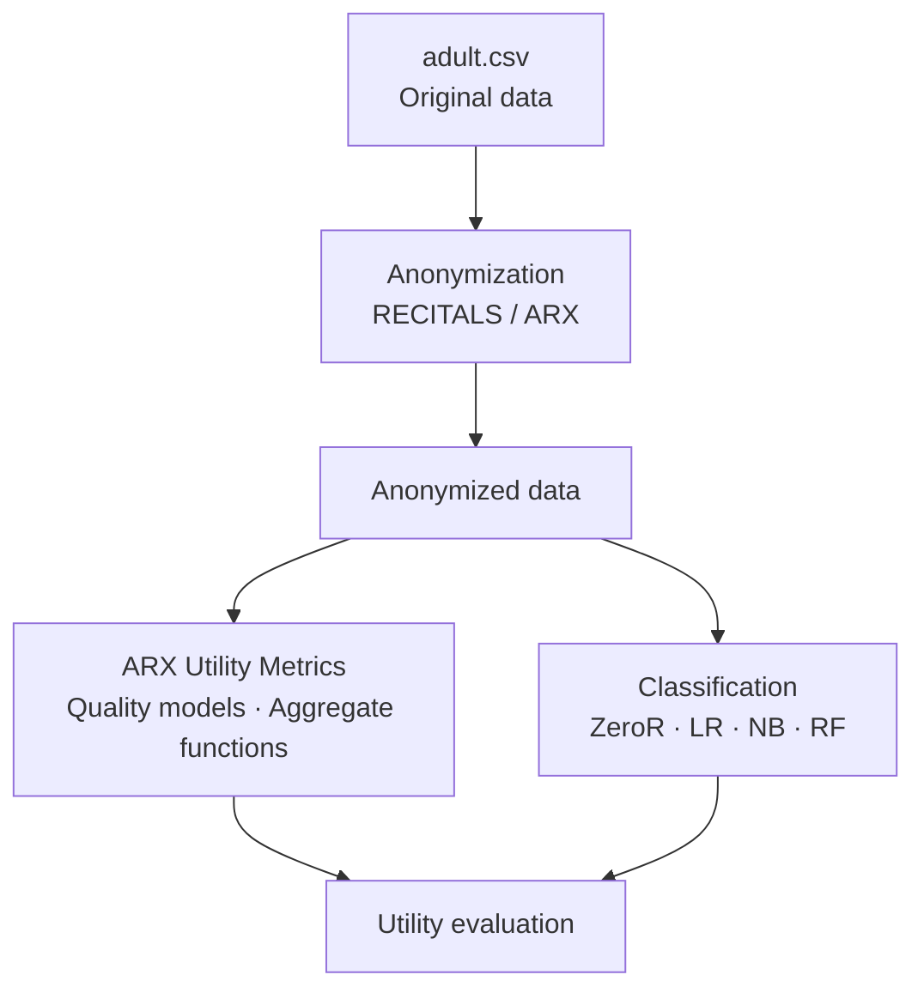

# Overview

This project is part of a **TER (Travail d'Étude et de Recherche)** and studies the impact of data anonymization on data utility — both from a statistical standpoint and from a supervised classification standpoint.

---

## Objective

Anonymization protects individual privacy by transforming data before publication. This transformation comes at a cost: it degrades the available information. The objective of this project is to **quantify the privacy-utility trade-off**, using the Adult (UCI) dataset and the [RECITALS](https://github.com/neithanmo/RECITALS-anonymization-manager) anonymization framework (ARX backend).

---

## Dataset

The dataset used is the **Adult dataset** (UCI Machine Learning Repository), containing 30,000+ records describing individuals from the U.S. Census.

The target attribute is income (`income`): `<=50K` or `>50K`.

---

## General pipeline

---

## Project structure

| Section | Description |
|---|---|
| [Anonymization](anonymisation/index.md) | Privacy models, generalization hierarchies, benchmark pipeline |
| [Quality Models](anonymisation/mesures_utilite.md) | ARX quality models used to guide optimization |
| [Aggregate Functions](anonymisation/fonctions_agregats.md) | Aggregating per-attribute scores into a global score |
| [ARX Utility Metrics](metriques/index.md) | Post-anonymization analysis metrics from RECITALS |
| [Classification](classification/index.md) | Utility evaluation through supervised classifiers |

---

## Tools

- **RECITALS** — Python anonymization framework, ARX backend
- **ARX** — Java anonymization engine (k-anonymity, l-diversity)
- **scikit-learn** — classification pipelines
- **pandas / numpy** — data processing
