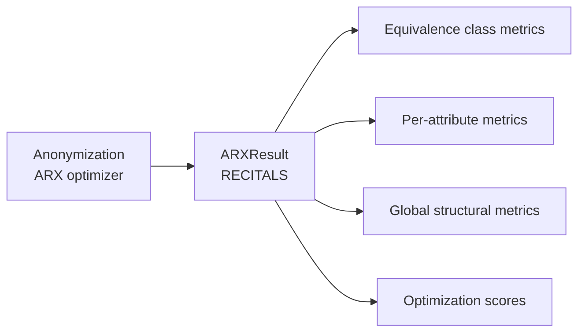

# ARX Utility Metrics

After each anonymization experiment, ARX — through the RECITALS interface — exposes a set of analysis metrics that characterize the structure and quality of the anonymized dataset. These metrics are retrieved from the `ARXResult` object returned by RECITALS.

---

## Role

While [quality models](../anonymisation/mesures_utilite.md) guide the optimizer *during* anonymization, the ARX utility metrics are read *after* anonymization to objectively characterize the result: how large are the equivalence classes, how much information was lost per attribute, how many records were suppressed.

---

## Equivalence class metrics

Equivalence classes are the groups of records that become indistinguishable from each other on the quasi-identifiers after anonymization.

| Metric | Description |
|---|---|
| **Number of equivalence classes** | Total count of distinct groups in the anonymized dataset |
| **Average equivalence class size** | Mean number of records per group |
| **Minimum equivalence class size** | Smallest group (ideally ≥ k) |
| **Maximum equivalence class size** | Largest group (large values indicate over-generalization) |
| **Number of suppressed records** | Records removed because no valid anonymization was found |

A well-anonymized dataset has equivalence classes whose sizes are close to each other (balanced groups) and whose minimum is at least k.

---

## Per-attribute metrics

These metrics are computed independently for each quasi-identifier and expose the degree and nature of generalization applied to that attribute.

### Granularity

Measures the proportion of information preserved for a given attribute after generalization. A value of **1** means no generalization was applied; a value of **0** means the attribute was fully suppressed.

$$\text{granularity}(a) = \frac{\text{preserved information}}{\text{total information in hierarchy}}$$

### Non-uniform Entropy

Measures the entropy of an attribute's distribution in the anonymized dataset, weighted by the actual frequencies in the original data. Unlike uniform entropy, it accounts for the fact that some values are more common than others.

A higher value indicates greater uncertainty about the original value — i.e., more information loss for that attribute.

### Generalization Intensity

Measures how deeply values were pushed into the generalization hierarchy for a given attribute. It is expressed as a ratio of the generalization level applied to the maximum height of the hierarchy.

$$\text{intensity}(a) = \frac{\text{applied generalization level}}{\text{max hierarchy height}}$$

- **0**: no generalization (original values kept).
- **1**: full generalization (values suppressed to `*`).

### Attribute-level Squared Error

Measures the squared error between original and generalized values for a given attribute, at the attribute level. It quantifies how far the generalized value is from the original, on average.

---

## Global structural metrics

### Discernibility

Penalizes large equivalence classes by computing the sum of the squares of all class sizes.

$$\text{discernibility} = \sum_{G \in \mathcal{G}} |G|^2$$

A lower value is better: it indicates that records are spread across many small, precise groups rather than a few large, vague ones.

### Ambiguity

Measures the total ambiguity across all records — i.e., the number of original records that each anonymized record could correspond to, summed across the dataset.

### SSESST — Sum of Squared Errors for Sensitive attributes

Measures the total squared error introduced on sensitive attributes (here `income`) by the anonymization process. A value of **0** means the sensitive attribute was never altered.

### Record-level Squared Error

Measures the squared error aggregated at the record level across all attributes. It quantifies the average distortion per record introduced by generalization.

---

## Optimization scores

ARX reports the value of the objective function (the chosen [quality model](../anonymisation/mesures_utilite.md)) for the transformation it selected.

| Score | Description |
|---|---|
| **Minimum optimization score** | Best (lowest) information loss found across the search |
| **Maximum optimization score** | Worst (highest) information loss found across the search |

For multi-attribute quality models (e.g. `loss` with `arithmetic_mean`), these scores may be a scalar or a vector depending on the chosen [aggregate function](../anonymisation/fonctions_agregats.md).

---

## Summary table

| Metric | Scope | Provided by |
|---|---|---|
| Number of equivalence classes | Global | `get_number_of_equivalence_classes()` |
| Average equivalence class size | Global | `get_average_equivalence_class_size()` |
| Min / Max equivalence class size | Global | `get_min/max_equivalence_class_size()` |
| Number of suppressed records | Global | `get_number_of_suppressed_records()` |
| Granularity | Per attribute | `get_granularity_metric(attribute)` |
| Non-uniform entropy | Per attribute | `get_non_uniform_entropy_metric(attribute)` |
| Generalization intensity | Per attribute | `get_generalization_intensity_metric(attribute)` |
| Attribute-level squared error | Per attribute | `get_attribute_level_squared_error_metric(attribute)` |
| Discernibility | Global | `get_discernability_metric()` |
| Ambiguity | Global | `get_ambiguity_metric()` |
| SSESST | Global | `get_ssesst_metric()` |
| Record-level squared error | Global | `get_record_level_squared_error_metric()` |
| Min / Max optimization score | Global | `get_optimization_score_min/max()` |
