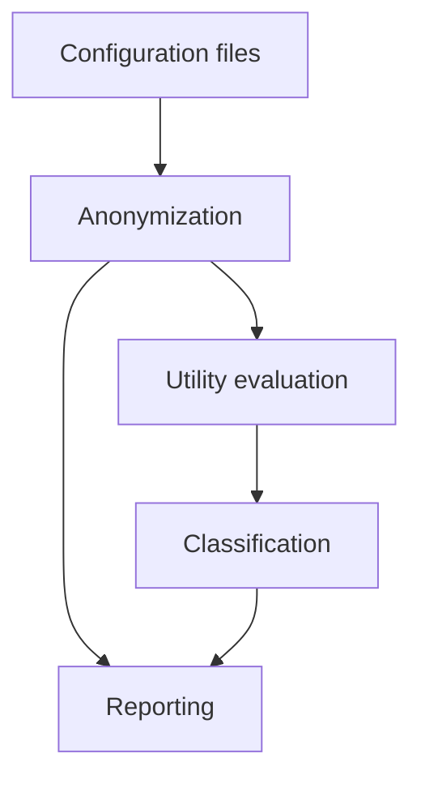
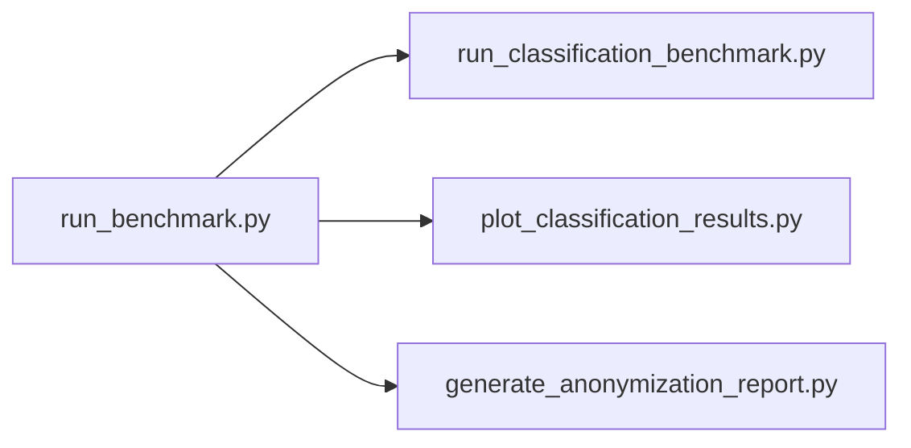

# Script Structure

This page describes the role of each script and configuration file in the project and how they relate to each other.

---

## General organization



---

## Configuration files

### `configs/base_config.json`

Defines the base anonymization setup shared across all experiments: dataset path, attribute roles, default privacy parameters, and backend.

```json
{
  "data": "data/adult.csv",
  "hierarchy_dir": "hierarchies",
  "quasi_identifiers": ["age", "sex", "race", "marital-status", "native-country"],
  "sensitive_attributes": ["income"],
  "insensitive_attributes": ["workclass", "fnlwgt", "education", ...],
  "k": 5,
  "l": 2,
  "t": null,
  "suppression_limit": 0.1,
  "utility_measure": "loss",
  "utility_aggregate": "arithmetic_mean",
  "backend": "arx"
}
```

---

### `configs/benchmark_grid.json`

Defines the parameter grid used by `run_benchmark.py` to generate all experiment combinations. Each combination of `qi_subset_sizes`, `k_values`, `l_values`, `utility_measures`, and `utility_aggregates` produces one independent experiment.

```json
{
  "base_config": "configs/base_config.json",
  "qi_pool": ["age", "sex", "race", "marital-status", "native-country"],
  "qi_subset_sizes": [2, 3, 4, 5],
  "k_values": [2, 5, 10, 20],
  "l_values": [2],
  "t_values": [null],
  "suppression_limits": [10],
  "utility_measures": ["loss", "precision", "height"],
  "utility_aggregates": ["arithmetic_mean", "geometric_mean", "sum", "maximum", "rank"],
  "backend": "arx",
  "save_anonymized_csv": true,
  "stop_on_error": false
}
```

---

### `configs/classification_config.json`

Configuration for the classification utility benchmark. Specifies the cross-validation setup, the target attribute, the active models, and — for each classifier — its hyperparameters. All values are fully configurable.

```json
{
  "n_folds": 10,
  "random_state": 42,
  "target": "income",
  "active_models": ["naive_bayes"],
  "feature_cols": ["age", "sex", "race", "marital-status", "native-country"],
  "classifiers": {
    "logistic_regression": { "enabled": true, "params": { "C": 100000, ... } },
    "naive_bayes":         { "enabled": true, "model": "MULTINOMIAL", "preprocessing": { "n_bins": 10 }, "params": { "alpha": 1.0 } },
    "random_forest":       { "enabled": true, "params": { "n_estimators": 500, ... } },
    "zero_r":              { "enabled": true }
  }
}
```

The `active_models` field controls which classifiers are actually run. It can be set to `"all"` or to a list of specific model names.

---

## Anonymization

### `run_one_experiment.py`

Core script that runs a single anonymization experiment end-to-end. It loads a configuration, calls RECITALS/ARX, collects all ARX result metrics, saves the anonymized CSV, and appends a row to the benchmark summary.

This is the most important script in the pipeline — all other evaluation scripts depend on its outputs.

- **Input**: one experiment config JSON
- **Output**: `outputs/anonymized/{id}.csv`, `outputs/metrics/{id}.json`, row in `benchmark_summary.csv`

---

### `run_benchmark.py`

Orchestrates the full benchmark grid. It reads `benchmark_grid.json`, generates all parameter combinations (QI subsets × k values × l values × utility measures × aggregate functions), builds a config for each, and calls `run_one_experiment.py` for each one.

- **Input**: `configs/benchmark_grid.json`, `configs/base_config.json`
- **Output**: one experiment per combination in `outputs/`

---

## Utility evaluation — Classification

### `classification_models.py`

Defines the four classifier pipelines (ZeroR, Logistic Regression, Naive Bayes, Random Forest) as factories — each call produces a fresh pipeline to avoid state leakage across cross-validation folds. Handles preprocessing of generalized and suppressed values.

---

### `compute_classification_metrics.py`

Computes all classification metrics (accuracy, relative accuracy, AUC, Brier score, Brier skill score, sensitivity, specificity) from the globally concatenated out-of-fold predictions. Mirrors ARX's metric computation strategy.

---

### `run_classification_benchmark.py`

Runs the classification utility benchmark over all successful experiments. For each experiment, it:

1. Loads the original and anonymized datasets (row-aligned)
2. Splits into 10 stratified folds on the original
3. Per fold: trains on original → predicts on original, trains on anonymized → predicts on anonymized
4. Concatenates OOF predictions globally and computes metrics

- **Input**: `outputs/benchmark_summary.csv`, original + anonymized CSVs
- **Output**: `outputs/classification/{id}_classification.json`, `outputs/classification_summary.csv`

---

## Reporting and visualization

### `generate_anonymization_report.py`

Generates a self-contained HTML report summarizing the anonymization results across all experiments. Includes summary tables and per-attribute statistics.

- **Input**: `outputs/benchmark_summary.csv`
- **Output**: HTML report file

---

### `plot_classification_results.py`

Generates PNG visualizations for a given classification result. Produces side-by-side input/output comparisons with summary metric tables, per-class statistics, and ROC curves (baseline / input / output).

- **Input**: `outputs/classification/{id}_classification.json`
- **Output**: PNG files

---

## Shared utilities

### `common.py`

Shared utility module used by all other scripts. Provides:

- `load_json()` / `save_json()` — JSON I/O
- `ensure_dir()` — directory creation
- `make_experiment_id()` — unique experiment naming
- `iter_qi_subsets()` — generate all QI combinations
- `build_hierarchy_mapping()` — map QI names to hierarchy CSV paths
- `collect_result_metrics()` — extract ARX metrics from a result object
- `sanitize_row_for_csv()` — flatten nested objects for CSV export

---

### `patch_recitals_arx.py`

One-time patch applied to the RECITALS ARX adapter. Converts the `suppression_limit` from a percentage (e.g. `10` for 10%) to the decimal format expected by ARX (`0.1`).

---

### `clean_outputs.py`

Deletes all generated output files to allow a clean restart of the benchmark. Clears `outputs/anonymized/`, `outputs/metrics/`, `outputs/classification/`, `benchmark_summary.csv`, and related files.

---

## Execution order



| Step | Script | Command |
|---|---|---|
| 1 | Run anonymization benchmark | `python scripts/run_benchmark.py --grid configs/benchmark_grid.json` |
| 2 | Run classification evaluation | `python scripts/run_classification_benchmark.py` |
| 3 | Generate plots | `python scripts/plot_classification_results.py --json outputs/classification/{id}_classification.json` |
| 4 | Generate HTML report | `python scripts/generate_anonymization_report.py` |
