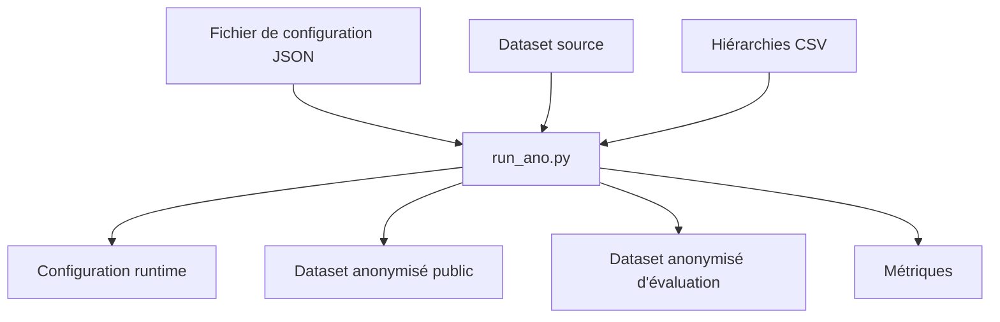

# Anonymisation

## Rôle de cette étape

L'anonymisation est la première étape centrale du projet.

Son rôle est de transformer un dataset original en une version publiée plus protectrice, tout en conservant un niveau d'utilité suffisant pour les analyses ultérieures.

Dans ce projet, l'anonymisation sert de point de départ aux deux attaques étudiées ensuite :

- la linkage attack ;
- la membership inference attack (MIA).

Autrement dit, avant de simuler un attaquant, il faut d'abord produire un dataset anonymisé.

---

## Script principal

Le script principal de cette étape est :

- `scripts/run_ano.py`

C'est lui qui orchestre l'exécution complète d'une anonymisation à partir d'un fichier de configuration.

---

## Idée générale

L'anonymisation suit une logique simple :

1. lire une configuration JSON ;
2. charger le dataset source ;
3. identifier les attributs à traiter ;
4. appliquer la configuration d'anonymisation ;
5. produire plusieurs fichiers de sortie :
   - la configuration effectivement utilisée ;
   - le dataset anonymisé public ;
   - le dataset anonymisé d'évaluation ;
   - les métriques d'anonymisation.

---

## Entrées de l'anonymisation

L'étape d'anonymisation repose principalement sur trois types d'entrées.

### 1. Le dataset source

Le point de départ est un dataset tabulaire, par exemple :

- `data/adult.csv`
- ou `data/adult_with_record_id.csv`

Selon les besoins du projet, le dataset peut contenir un identifiant interne comme `record_id`, utile pour l'évaluation mais qui ne doit pas être exposé publiquement.

### 2. Le fichier de configuration

L'anonymisation est pilotée par un fichier JSON qui décrit les paramètres de l'expérience.

Ce fichier contient notamment :

- le chemin du dataset ;
- les quasi-identifiants ;
- l'attribut sensible ;
- les attributs insensibles ;
- les hiérarchies à utiliser ;
- les paramètres d'anonymisation comme `k`, `l`, `t` ;
- la limite de suppression.

### 3. Les hiérarchies de généralisation

Certains attributs disposent de hiérarchies CSV permettant de généraliser les valeurs.

Exemples :

- `hierarchies/age.csv`
- `hierarchies/sex.csv`
- `hierarchies/race.csv`
- `hierarchies/native-country.csv`

Ces hiérarchies indiquent comment passer d'une valeur précise à une valeur plus générale.

Par exemple, un âge précis peut être remplacé par un intervalle, ou un pays par une région plus large.

---

## Types d'attributs utilisés

Pour comprendre l'anonymisation, il faut distinguer les rôles des colonnes.

### Quasi-identifiants

Les quasi-identifiants sont les attributs qui peuvent aider à ré-identifier un individu lorsqu'ils sont recoupés.

Exemples fréquents dans le projet :

- `age`
- `sex`
- `race`
- `marital-status`
- `native-country`

Ce sont principalement ces attributs qui sont généralisés ou supprimés.

### Attribut sensible

L'attribut sensible est celui que l'on veut protéger du mieux possible.

Dans le dataset Adult, il s'agit souvent de :

- `income`

### Attributs insensibles

Les attributs insensibles ne sont pas utilisés comme quasi-identifiants et ne servent pas directement à protéger l'identité.

---

## Paramètres d'anonymisation

La configuration peut inclure plusieurs paramètres classiques.

### k-anonymity

Le paramètre `k` impose qu'un enregistrement ne puisse pas être distingué de moins de `k - 1` autres enregistrements sur les quasi-identifiants.

### l-diversity

Le paramètre `l` impose une diversité minimale de l'attribut sensible dans les classes d'équivalence.

### t-closeness

Le paramètre `t` contraint la distribution de l'attribut sensible dans chaque groupe à rester proche de la distribution globale.

### Suppression

Une limite de suppression peut être fixée pour autoriser la suppression d'une partie des données lorsque la généralisation seule ne suffit pas.

---

## Déroulement logique de `run_ano.py`

Le script suit globalement la séquence suivante.

### 1. Lecture de la configuration

Le script commence par charger le fichier JSON de configuration.

Cette configuration décrit l'expérience à exécuter.

### 2. Construction de la configuration runtime

Le script construit ensuite une version complète et exploitable de la configuration.

Cette étape sert notamment à :

- résoudre les chemins ;
- compléter les paramètres manquants ;
- figer exactement les valeurs utilisées pendant l'exécution.

La configuration runtime est ensuite sauvegardée dans `outputs/configs/`.

### 3. Lancement de l'anonymisation

Le script appelle ensuite le gestionnaire d'anonymisation du projet.

Ce gestionnaire applique les règles définies dans la configuration :

- identification des quasi-identifiants ;
- chargement des hiérarchies ;
- application des contraintes de confidentialité ;
- production du dataset anonymisé.

### 4. Sauvegarde des sorties

Une fois l'anonymisation terminée, le script enregistre les sorties utiles du run.

---

## Sorties produites

L'anonymisation produit plusieurs fichiers importants.

### 1. Configuration exécutée

Dossier :

- `outputs/configs/`

Cette configuration correspond à la version réellement utilisée pendant l'exécution.

Elle est utile pour :

- reproduire une expérience ;
- vérifier les paramètres exacts ;
- documenter les résultats.

### 2. Dataset anonymisé public

Dossier :

- `outputs/anonymized/`

C'est la version censée représenter ce qui serait réellement publié.

Elle peut exclure des colonnes internes comme `record_id`.

C'est cette version qui représente la vue réaliste de l'attaquant.

### 3. Dataset anonymisé d'évaluation

Dossier :

- `outputs/anonymized_eval/`

Cette version est réservée à l'évaluation interne.

Elle conserve certaines informations utiles à la vérification des attaques, en particulier les identifiants internes.

Elle ne doit pas être considérée comme un fichier publié à l'attaquant.

### 4. Métriques

Dossier :

- `outputs/metrics/`

Ces fichiers résument les résultats de l'anonymisation.

Ils peuvent contenir des indicateurs utiles pour comparer plusieurs expériences.

## Exemple de logique

On peut résumer l'étape d'anonymisation ainsi :

- on choisit un ensemble de quasi-identifiants ;
- on impose des contraintes de confidentialité ;
- on généralise ou supprime certaines valeurs ;
- on produit une version publiable du dataset ;
- on conserve une version interne pour l'évaluation.

---

## Schéma simplifié

