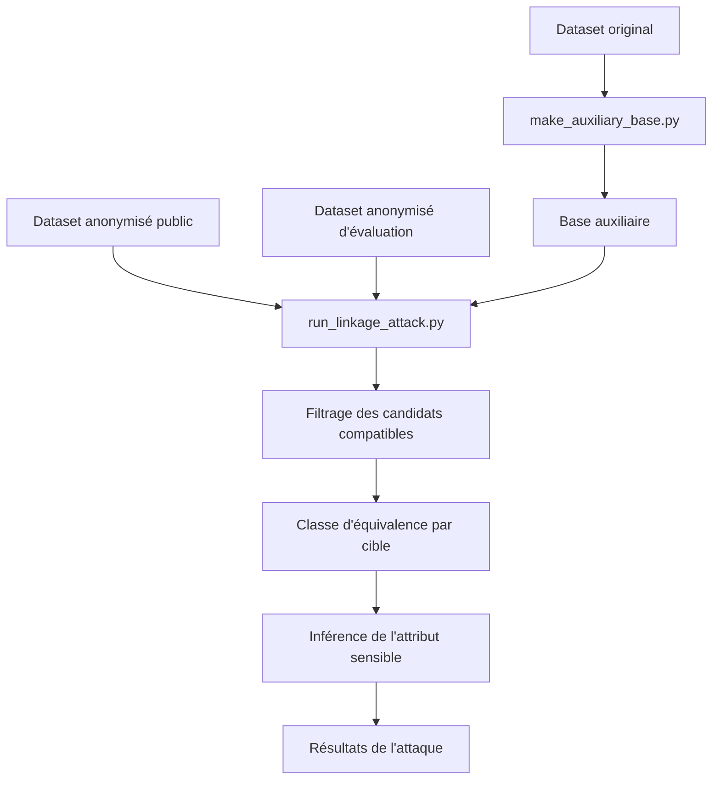

# Linkage attack

## Rôle de cette étape

La **linkage attack** cherche à simuler un attaquant qui possède déjà certaines informations sur des individus et qui essaie de les relier à des enregistrements du dataset anonymisé.

L'objectif n'est pas forcément de retrouver immédiatement un identifiant exact, mais de mesurer dans quelle mesure les données publiées restent **compatibles** avec les informations connues par l'attaquant.

Dans ce projet, la linkage attack sert surtout à répondre à deux questions :

- est-ce qu'un individu peut encore être isolé ou fortement réduit à un petit nombre de candidats ;
- est-ce qu'on peut en déduire son **attribut sensible** à partir des candidats restants.

---

## Idée générale

Le principe global est simple :

1. l'attaquant dispose d'une **base auxiliaire** contenant certaines informations sur des cibles ;
2. il compare ces informations au dataset anonymisé publié ;
3. il conserve tous les enregistrements **compatibles** avec la cible ;
4. l'ensemble des candidats compatibles forme une **classe d'équivalence** pour cette cible ;
5. à partir de cette classe, il essaie d'inférer l'attribut sensible.

Autrement dit, la linkage attack ne consiste pas seulement à dire "j'ai retrouvé la bonne ligne", mais plutôt à mesurer à quel point l'anonymisation laisse encore des possibilités de liaison ou d'inférence.

---

## Scripts principaux

Les scripts principaux de cette étape sont :

- `scripts/make_auxiliary_base.py`
- `scripts/run_linkage_attack.py`

Le premier prépare la base auxiliaire de l'attaquant.  
Le second exécute l'attaque proprement dite.

Dans certains cas, une variante utilisant `privJedAI` peut aussi être utilisée pour certains traitements plus souples sur les correspondances de valeurs, mais la logique principale de l'attaque reste la même.

---

## Données utilisées par l'attaque

La linkage attack repose sur trois ensembles de données.

### 1. La base auxiliaire de l'attaquant

Elle contient les informations connues par l'attaquant sur certaines cibles.

Par exemple, l'attaquant peut connaître :

- `age`
- `sex`
- `race`
- `marital-status`
- `native-country`

Cette base n'est pas nécessairement identique au dataset anonymisé publié.  
Elle représente la connaissance externe disponible pour l'attaquant.

### 2. Le dataset anonymisé public

C'est le dataset censé représenter ce qui est réellement publié après anonymisation.

Il est utilisé comme vue réaliste de l'attaquant.

### 3. Le dataset anonymisé d'évaluation

Cette version est utilisée uniquement en interne pour vérifier les résultats de l'attaque.

Elle permet notamment de savoir si la vraie cible faisait bien partie des candidats compatibles, sans exposer ces informations dans la version publique.

---

## Ce que sait l'attaquant

Dans ce projet, l'attaquant connaît un sous-ensemble d'attributs sur une cible donnée.

L'attaque repose donc sur une hypothèse réaliste : l'attaquant possède une connaissance partielle, mais potentiellement suffisante pour réduire fortement le nombre de candidats.

---

## Notion de compatibilité

La notion centrale de cette attaque est la **compatibilité**.

Une ligne du dataset anonymisé est considérée comme compatible avec une cible si, pour tous les attributs connus par l'attaquant, la valeur publiée reste cohérente avec l'information connue.

### Exemple simple

Si l'attaquant connaît :

- `sex = Male`
- `race = White`
- `age = 27`

et que le dataset anonymisé contient une ligne avec :

- `sex = Male`
- `race = White`
- `age = [20-29]`

alors cette ligne est compatible avec la cible, car l'âge 27 appartient à l'intervalle `[20-29]`.

En revanche, une ligne avec :

- `sex = Female`

ne serait pas compatible.

---

## Classe d'équivalence obtenue par l'attaque

Pour chaque cible, l'attaque filtre le dataset anonymisé et conserve tous les enregistrements compatibles.

L'ensemble de ces enregistrements constitue la **classe d'équivalence de la cible du point de vue de l'attaquant**.

Cette classe peut avoir plusieurs tailles :

### Classe vide
Aucun enregistrement n'est compatible.  
L'attaquant ne trouve aucun candidat.

### Classe de taille 1
Un seul enregistrement est compatible.  
La cible est alors fortement isolée du point de vue de l'attaque.

### Classe de taille supérieure à 1
Plusieurs candidats restent possibles.  
L'attaque ne retrouve pas un individu unique, mais elle réduit l'incertitude à un sous-ensemble plus petit.

---

## Objectif réel de la linkage attack dans le projet

Dans ce projet, la linkage attack ne sert pas seulement à retrouver une cible.  
Elle sert aussi à **inférer l'attribut sensible** à partir de la classe d'équivalence obtenue.

La logique est la suivante :

- si un seul candidat reste, l'attribut sensible de ce candidat est retenu ;
- si plusieurs candidats restent mais qu'ils partagent tous la même valeur sensible, alors cette valeur est retrouvée avec une forte certitude ;
- si plusieurs valeurs sensibles coexistent dans la classe, on produit une distribution de probabilité à partir des fréquences observées.

---

## Inférence de l'attribut sensible

Une fois la classe d'équivalence construite, on regarde les valeurs de l'attribut sensible parmi les candidats.

### Cas 1 : un seul candidat
Si la classe contient une seule ligne, l'attribut sensible de cette ligne est celui prédit pour la cible.

### Cas 2 : plusieurs candidats, une seule valeur sensible
Si tous les candidats ont la même valeur sensible, cette valeur est prédite à 100 %.

### Cas 3 : plusieurs candidats, plusieurs valeurs sensibles
Dans ce cas, l'attaque produit une répartition.

Par exemple, si la classe contient 4 candidats et que :

- 3 ont `income = >50K`
- 1 a `income = <=50K`

alors la prédiction peut être formulée comme :

- `>50K` : 75 %
- `<=50K` : 25 %

L'idée est donc de mesurer ce que l'attaquant peut apprendre sur l'attribut sensible même sans retrouver une ligne unique.

---

## Déroulement logique de `make_auxiliary_base.py`

Ce script prépare la base auxiliaire de l'attaquant.

Sa logique générale est la suivante :

1. partir du dataset original ;
2. sélectionner un sous-ensemble d'individus ;
3. sélectionner les colonnes connues par l'attaquant ;
4. produire un fichier auxiliaire dans `outputs/auxiliary/`.

Cette base sert ensuite d'entrée à la linkage attack.

---

## Déroulement logique de `run_linkage_attack.py`

Le script d'attaque suit globalement les étapes suivantes.

### 1. Chargement des fichiers
Le script charge :

- la configuration d'expérience ;
- la base auxiliaire ;
- le dataset anonymisé public ;
- le dataset anonymisé d'évaluation.

### 2. Sélection des attributs connus
Le script identifie les attributs que l'attaquant est supposé connaître.

Ces attributs servent de base pour tester la compatibilité des lignes anonymisées.

### 3. Parcours des cibles
Chaque ligne de la base auxiliaire peut être traitée comme une cible potentielle.

Pour chaque cible, l'attaque essaie de retrouver l'ensemble des lignes anonymisées compatibles.

### 4. Filtrage des candidats
Le dataset anonymisé est filtré selon les attributs connus.

Toutes les lignes incompatibles sont rejetées.

### 5. Construction de la classe d'équivalence
Les lignes restantes forment la classe d'équivalence de la cible.

### 6. Inférence de l'attribut sensible
À partir de cette classe, le script calcule la ou les valeurs sensibles possibles et leur fréquence.

### 7. Sauvegarde des résultats
Les résultats détaillés et les résumés sont enregistrés dans `outputs/attacks/`.

---

## Pourquoi utiliser aussi le dataset d'évaluation ?

Le dataset d'évaluation n'est pas là pour aider l'attaquant.

Il sert uniquement à vérifier les résultats en interne.

Par exemple, il peut permettre de savoir :

- si le vrai record de la cible était bien dans les candidats ;
- quelle était la vraie valeur sensible associée ;
- si l'attaque a correctement réduit ou non l'espace des possibilités.

---

## Rôle éventuel de `privJedAI`

Certaines variantes de l'attaque peuvent intégrer `privJedAI` pour traiter des correspondances plus souples entre certaines valeurs.

Cette partie est surtout utile quand deux valeurs proches ne sont pas écrites exactement de la même manière.

Cependant, dans le cadre principal du projet, la logique à retenir reste la suivante :

- on part d'une cible ;
- on cherche les lignes compatibles ;
- on forme une classe d'équivalence ;
- on infère l'attribut sensible.

`privJedAI` peut améliorer certains appariements, mais ne remplace pas cette logique générale.

---

## Sorties produites

La linkage attack produit généralement des sorties dans `outputs/attacks/`, par exemple :

- des fichiers détaillant les candidats trouvés ;
- des résumés par cible ;
- un fichier `summary.json` ;
- des CSV de résultats.

Ces fichiers permettent d'analyser :

- le nombre de candidats par cible ;
- le nombre de cibles sans match ;
- les cas où une cible est retrouvée seule ;
- les distributions prédites pour l'attribut sensible.

---

## Ce que mesure réellement l'attaque

La linkage attack permet de mesurer plusieurs choses.

### Réduction de l'incertitude
Même sans retrouver une cible unique, réduire le nombre de candidats peut déjà être une fuite d'information importante.

### Risque de ré-identification
Une classe d'équivalence très petite signifie qu'un individu reste assez isolable malgré l'anonymisation.

### Risque d'inférence sensible
Même si plusieurs candidats restent possibles, l'attribut sensible peut parfois être déduit presque entièrement.

Par exemple, une classe de taille 5 n'est pas forcément rassurante si les 5 candidats ont tous le même attribut sensible.

---

## Schéma simplifié

