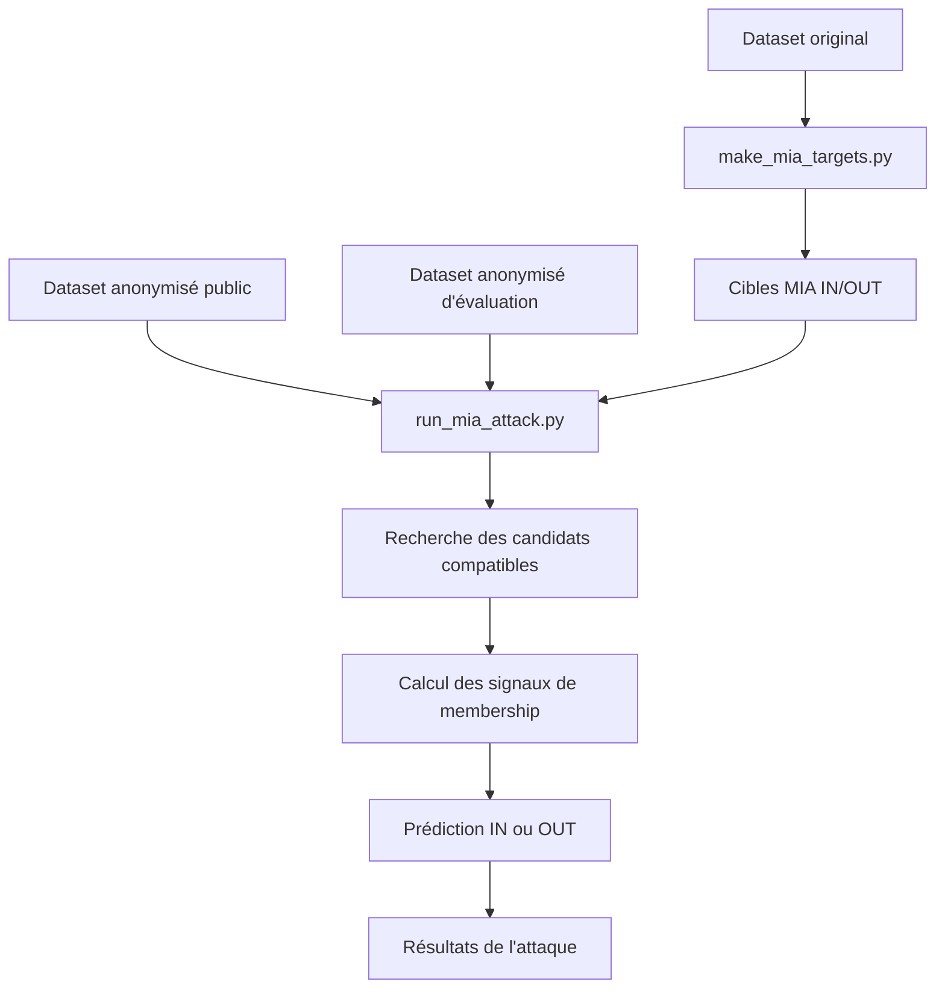

# Membership Inference Attack (MIA)

## Rôle de cette étape

La **Membership Inference Attack (MIA)** cherche à déterminer si une cible donnée appartenait ou non au dataset publié avant anonymisation.

Autrement dit, l'attaquant ne cherche plus ici à retrouver directement une ligne précise ni à inférer en priorité un attribut sensible.  
Il cherche à répondre à la question suivante :

**"Cette personne faisait-elle partie du dataset utilisé pour produire les données anonymisées publiées ?"**

Dans le cadre du projet, cette attaque permet donc d'évaluer un autre type de fuite de vie privée : la fuite d'**appartenance**.

---

## Idée générale

La logique générale de la MIA est la suivante :

1. on construit un ensemble de cibles ;
2. certaines cibles sont réellement **membres** du dataset publié ;
3. d'autres sont réellement **non membres** ;
4. l'attaque compare les informations connues sur chaque cible aux enregistrements du dataset anonymisé ;
5. à partir des correspondances possibles, elle prédit si la cible est probablement **IN** ou **OUT**.

L'idée centrale est qu'un individu peut parfois être reconnu comme "ayant participé au dataset" même si son enregistrement exact n'est pas directement visible.

---

## Scripts principaux

Les scripts principaux de cette étape sont :

- `scripts/make_mia_targets.py`
- `scripts/run_mia_attack.py`

Le premier prépare les cibles utilisées pour l'attaque.  
Le second exécute la MIA à partir de ces cibles et du dataset anonymisé.

---

## Ce que cherche à prédire la MIA

La sortie principale de la MIA est une prédiction binaire :

- **IN** : la cible est prédite comme membre du dataset publié ;
- **OUT** : la cible est prédite comme non membre.

Dans les fichiers, cette information peut être représentée par une colonne du type :

- `is_member = 1` pour IN
- `is_member = 0` pour OUT

Cette colonne sert de vérité terrain pour évaluer la qualité de l'attaque.

---

## Différence avec la linkage attack

Même si les deux attaques utilisent une logique de compatibilité, elles ne cherchent pas à répondre à la même question.

### Linkage attack
La linkage attack cherche surtout à savoir :

- quels enregistrements anonymisés sont compatibles avec une cible ;
- ce qu'on peut en déduire sur l'attribut sensible.

### MIA
La MIA cherche surtout à savoir :

- si la cible faisait partie ou non du dataset publié.

Autrement dit :

- la linkage attack traite surtout le **risque de liaison** et d'**inférence sensible** ;
- la MIA traite le **risque d'appartenance**.

---

## Données utilisées par l'attaque

La MIA repose sur trois ensembles de données principaux.

### 1. Les cibles MIA

Ce fichier contient les individus testés par l'attaque.

Chaque cible contient :

- un identifiant interne ;
- certains attributs connus par l'attaquant ;
- un label de vérité terrain indiquant si elle est membre ou non.

Ce fichier est produit par `make_mia_targets.py`.

### 2. Le dataset anonymisé public

C'est la version censée représenter ce que l'attaquant voit réellement.

La MIA utilise ce dataset comme source principale d'information observable.

### 3. Le dataset anonymisé d'évaluation

Cette version est utilisée uniquement pour vérifier les résultats de l'attaque.

Elle permet de conserver une logique d'évaluation interne sans exposer trop d'informations dans la version publique.

---

## Construction des cibles MIA

Le script `make_mia_targets.py` prépare un ensemble de cibles avec une séparation entre individus IN et OUT.

La logique générale est la suivante :

1. partir du dataset original ;
2. choisir un pourcentage d'individus **OUT** ;
3. retirer ces individus du dataset qui sera ensuite publié ;
4. construire aussi un échantillon **IN** à partir des individus restants ;
5. regrouper les cibles IN et OUT dans un même fichier ;
6. associer à chaque cible un label indiquant la vérité terrain.

Cette étape est essentielle car elle définit précisément ce que l'attaque devra deviner.

---

## Signification des cibles IN et OUT

### Cibles IN
Ce sont des individus réellement présents dans le dataset qui a servi à produire le dataset anonymisé publié.

### Cibles OUT
Ce sont des individus absents du dataset publié.

Ils servent de contre-exemples pour vérifier si l'attaque a tendance à sur-prédire la présence d'une cible.

---

## Ce que sait l'attaquant

Comme pour la linkage attack, l'attaquant ne connaît pas tout.

Il connaît seulement un sous-ensemble d'attributs sur chaque cible, par exemple :

- `age`
- `sex`
- `race`

Ces attributs sont appelés ici les **known QIDs**.

L'attaque repose donc sur une hypothèse réaliste : l'attaquant possède quelques informations externes sur une personne et essaie de décider si cette personne faisait partie du dataset publié.

---

## Notion de compatibilité

La MIA repose elle aussi sur une logique de compatibilité.

Pour une cible donnée, on cherche les lignes du dataset anonymisé qui restent cohérentes avec les attributs connus.

### Exemple simple

Si l'attaquant connaît :

- `age = 27`
- `sex = Male`
- `race = White`

et qu'une ligne anonymisée contient :

- `age = [20-29]`
- `sex = Male`
- `race = White`

alors cette ligne est compatible avec la cible.

Plus une cible possède de candidats compatibles plausibles dans le dataset anonymisé, plus cela peut constituer un signal d'appartenance.

---

## Intuition générale de la décision IN/OUT

L'idée intuitive est la suivante :

- si une cible n'a **aucun candidat compatible**, cela suggère qu'elle est probablement **OUT** ;
- si une cible a **un ou plusieurs candidats compatibles forts**, cela suggère qu'elle est peut-être **IN** ;
- si elle a trop de candidats très vagues, la décision devient plus incertaine.

La MIA repose donc sur des indices comme :

- le nombre de candidats compatibles ;
- la qualité de compatibilité ;
- parfois le meilleur score observé ;
- parfois la proportion du dataset compatible avec la cible.

---

## Déroulement logique de `make_mia_targets.py`

Le script suit globalement les étapes suivantes :

### 1. Chargement du dataset original
Le script lit le dataset de départ.

### 2. Sélection des individus OUT
Un pourcentage du dataset est tiré pour former les individus OUT.

Ces individus seront absents du dataset publié.

### 3. Sélection des individus IN
Parmi les individus restants, un échantillon est prélevé pour former les cibles IN.

### 4. Construction du fichier de cibles
Les deux groupes sont réunis dans un même fichier.

Chaque ligne contient :

- les attributs connus par l'attaquant ;
- l'identifiant de la cible ;
- le label `is_member`.

### 5. Sauvegarde
Le fichier est enregistré dans `outputs/mia_targets/`.

---

## Déroulement logique de `run_mia_attack.py`

Le script d'attaque suit globalement les étapes suivantes.

### 1. Chargement des fichiers
Le script charge :

- la configuration d'expérience ;
- le fichier des cibles ;
- le dataset anonymisé public ;
- le dataset anonymisé d'évaluation.

### 2. Lecture des attributs connus
Le script identifie les colonnes que l'attaquant est supposé connaître.

Ces colonnes servent à tester la compatibilité.

### 3. Parcours des cibles
Chaque cible du fichier MIA est traitée séparément.

### 4. Recherche des candidats compatibles
Le script parcourt le dataset anonymisé et conserve les lignes compatibles avec la cible.

### 5. Calcul d'indicateurs
À partir des candidats trouvés, le script peut calculer plusieurs signaux utiles :

- nombre de candidats compatibles ;
- fraction compatible dans le dataset ;
- meilleur score de compatibilité ;
- autres indicateurs dérivés selon la configuration.

### 6. Prédiction IN ou OUT
Le script transforme ensuite ces signaux en décision finale :

- prédiction IN
- ou prédiction OUT

### 7. Sauvegarde des résultats
Les résultats sont enregistrés dans `outputs/attacks/`.

---

## Logique de décision

La décision finale dépend de la stratégie utilisée dans le script, mais l'idée générale reste la même :

### Cas favorable à OUT
Si la cible ne correspond à aucune ligne compatible, ou seulement à des signaux très faibles, elle est plutôt prédite comme **OUT**.

### Cas favorable à IN
Si la cible possède une compatibilité forte avec une ou plusieurs lignes du dataset anonymisé, elle est plutôt prédite comme **IN**.

### Cas ambigus
Si les signaux sont intermédiaires, la décision dépend des seuils choisis dans l'attaque.

Par exemple, le script peut utiliser des paramètres comme :

- un nombre maximal de candidats compatibles toléré ;
- une fraction maximale du dataset compatible ;
- un score minimal pour considérer une cible comme plausible.

---

## Pourquoi utiliser aussi le dataset d'évaluation ?

Comme pour la linkage attack, le dataset d'évaluation n'est pas utilisé pour aider l'attaquant.

Il sert uniquement à vérifier les résultats en interne, par exemple pour :

- relier les prédictions aux vrais enregistrements ;
- confirmer les labels réels ;
- produire des métriques fiables.

Cette séparation évite de confondre le scénario d'attaque avec le scénario d'évaluation.

---

## Sorties produites

La MIA génère généralement des fichiers dans `outputs/attacks/`, par exemple :

- des résultats détaillés par cible ;
- des résumés globaux ;
- des fichiers JSON ;
- des CSV contenant les prédictions et indicateurs.

Ces sorties permettent d'analyser :

- combien de cibles IN ont été correctement reconnues ;
- combien de cibles OUT ont été faussement reconnues comme membres ;
- quelles cibles restent ambiguës ;
- quelles configurations d'anonymisation résistent mieux à l'attaque.

---

## Ce que mesure réellement la MIA

La MIA ne mesure pas directement la ré-identification d'une personne.

Elle mesure plutôt le risque suivant :

**le simple fait d'appartenir au dataset peut-il encore être deviné après anonymisation ?**

C'est une fuite importante dans de nombreux contextes sensibles.

Par exemple, même sans connaître la valeur exacte d'un attribut sensible, apprendre qu'une personne était présente dans un dataset médical, administratif ou social peut déjà constituer une atteinte à la vie privée.

---

## Schéma simplifié

