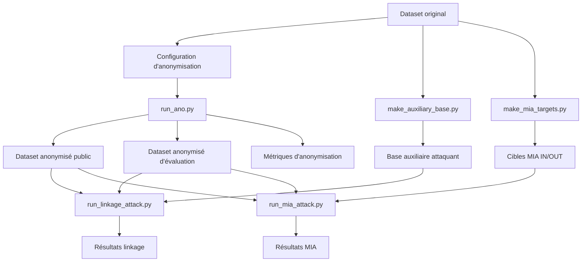

# Vue générale du projet

## Objectif du projet

Ce projet étudie l'effet de l'anonymisation d'un dataset sur la protection de la vie privée, en se concentrant sur trois parties principales :

- l'anonymisation du dataset ;
- la **linkage attack** ;
- la **membership inference attack (MIA)**.

L'idée générale est la suivante : on part d'un dataset original, on applique une anonymisation, puis on mesure dans quelle mesure un attaquant peut encore exploiter les données publiées.

## Idée générale du pipeline

Le projet repose sur un pipeline en plusieurs étapes :

1. on part d'un dataset original ;
2. on prépare une configuration d'anonymisation ;
3. on lance l'anonymisation ;
4. on obtient un dataset anonymisé public, ainsi qu'une version d'évaluation interne ;
5. on prépare les données nécessaires aux attaques ;
6. on exécute la linkage attack et/ou la MIA ;
7. on sauvegarde les résultats d'attaque dans `outputs/`.

